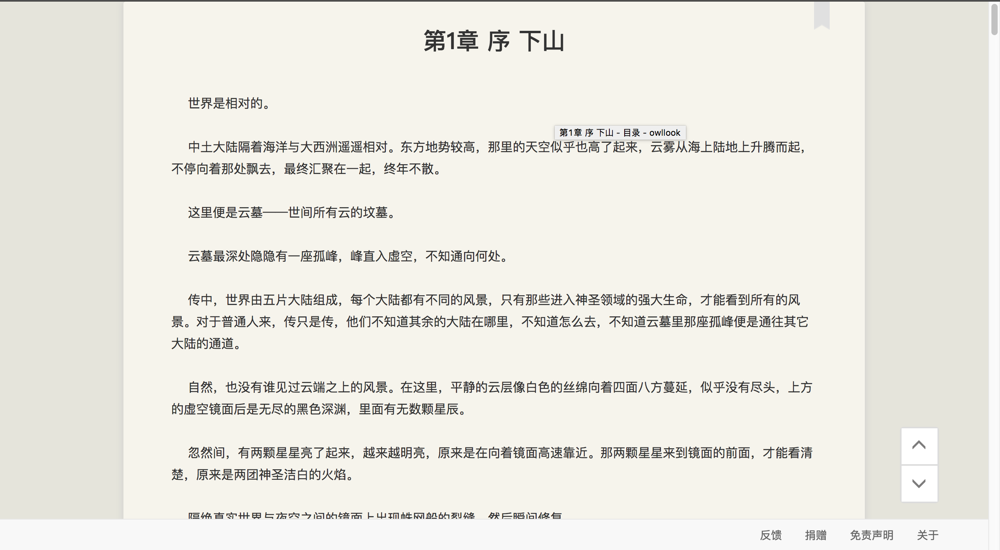

### 

### 1.说明

网络小说搜索引擎——owllook 网址：[https://www.owllook.net/](https://www.owllook.net/)

> `owllook`是一个基于其他网站的垂直小说搜索引擎，至于为什么写这个，一个是想利用`sanic`尽量做成异步服务，二是想就此练习下推荐系统，顺便作为毕业设计。
> 如果将本项目部署并发行，请声明来源。

**本项目纯属共享学习之用，不得用于商业！**

- sanic：基于Python 3.5+的异步web服务器
- sanic_session：sanic的持续会话插件
- vloop：sanic默认使用uvloop，替代asyncio本身的loop
- motor：异步的mongodb驱动
- aiohttp：异步请求
- aiocache：异步缓存，本项目改用了其中的decorator部分，缓存数据库使用redis
- caddy：基于go的web服务器

对于用户信息，利用mongodb进行存储。

某些必要的缓存，利用redis进行缓存处理，注意，对于限制数据：都将在24小时删除。

对于不同网站的小说，页面规则都不尽相同，我希望能够在代码解析后再统一展示出来，这样方便且美观，而不是仅仅跳转到对应网站就完事，清新简洁的阅读体验才是最重要的。

目前采用的是直接在百度上进行结果检索（现在发现百度不行，又加了360，谷歌的也写了一个，部分数据准备开始用爬虫获取），也不是不能做的更大更全，只是觉得没什么意义，目前的检索结果已经很足够。

我尽量写少量的规则来完成解析，具体见[规则定义](https://github.com/howie6879/novels-search/blob/master/docs/%E8%A7%84%E5%88%99%E5%AE%9A%E4%B9%89.md)，遇到自己喜欢的小说网站，你也可以自己添加解析。

BTW，sanic写界面确实不是很方便。

详细介绍[owllook -- 一个简洁的网络小说搜索引擎](http://www.jianshu.com/p/257345cd9009)

**运行：**

`python server.py`

或者

`gunicorn --bind 127.0.0.1:8001 --worker-class sanic_gunicorn.Worker server:app`

### 2.demo

下面是一些截图展示，具体效果图请看[这里](http://oe7yjec8x.bkt.clouddn.com/howie/2017-03-08-owllook.gif)：

目录解析页：

阅读：

书架：

### 3.关于

**0.1.0：**

- 小说的基本搜索解析功能
- 搜索记录
- 缓存
- 书架
- 书签
- 登录（暂时不开放注册，可与我申请体验）
- 初步兼容手机（后续跟进）

**TODO:**

- [x] 注册
- [x] 上次阅读
- [x] 最新章节
- [x] 书友推荐（很基础的推荐）
- [x] 目录获取
- [x] 翻页

- [ ] 推荐
- [ ] 搜索排行
- [ ] 阅读书单

- [ ] 排行榜

### License

`owllook` is offered under the Apache 2 license.