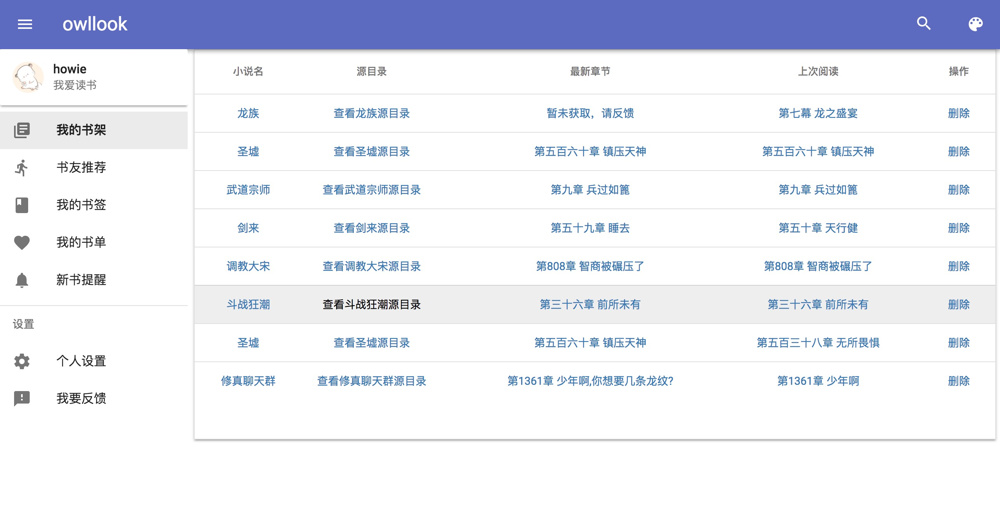
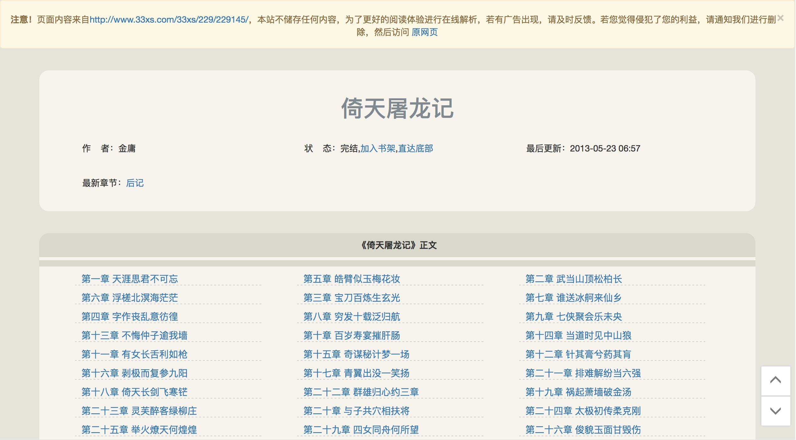
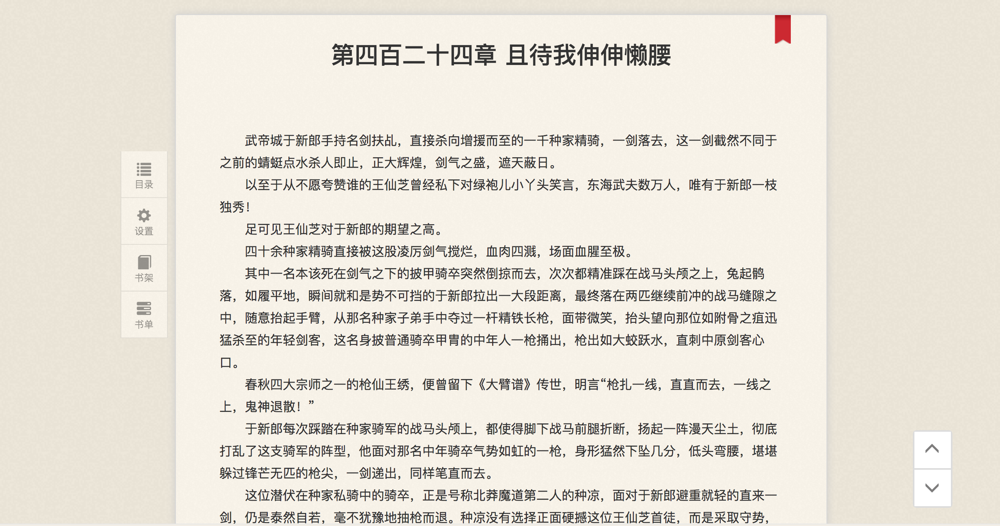

## owllook - 在线小说搜索引擎

 [](https://github.com/howie6879/owllook) [](https://github.com/howie6879/owllook)

`owllook`是一个基于其他搜索引擎构建的垂直小说搜索引擎，owllook目的是让阅读更简单、优雅，让每位读者都有舒适的阅读体验，如**搜书、阅读、收藏、追更、推荐等功能**：

- ~~演示网址（不维护了，有兴趣自己搭建）~~：[https://www.owllook.net/](https://www.owllook.net/)
- 公众号：[**粮草小说**](https://www.owllook.net/static/novels/img/lcxs_show.jpg)，有兴趣的话可以关注下
- 详细安装介绍：[详细安装介绍](https://mp.weixin.qq.com/s/0CqLiKsyDQ-pVmeo3R-UlA)
- 个人公众号：[老胡的储物柜](https://raw.githubusercontent.com/howie6879/howie6879.github.io/img/pictures/20190529083905.png)

<div align=center></div>

衍生项目：

- 终端看小说： [NIYT](https://github.com/howie6879/NIYT)
- 小说监控工具：[owllook_gui](https://github.com/howie6879/owllook_gui)
- 小说接口：[owllook_api](https://github.com/howie6879/owllook_api)

**注意**：若将本项目部署并发行，请**声明来源**，本项目纯属**共享学习之用，不得用于商业！**

### Overview

`owllook`使用了mongodb储存了用户使用过程中的产生的基本信息，诸如注册信息、搜索小说信息、收藏小说数据等，对于某些必要的缓存，则利用redis进行缓存处理，如小说缓存、session缓存，注意，对于限制数据：都将在24小时删除

对于不同网站的小说，页面规则都不尽相同，我希望能够在代码解析后再统一展示出来，这样方便且美观，而不是仅仅跳转到对应网站就完事，清新简洁的阅读体验才是最重要的

目前采用的是直接在搜索引擎上进行结果检索，我尽量写少量的规则来完成解析，具体见[规则定义](./docs/规则定义.md)，遇到自己喜欢的小说网站，你也可以自己添加解析，`owllook`目前解析了超过 **200+** 网站，追更网站解析了**50+**

有一些地方需要用到爬虫，比如说排行榜，一些书籍信息等，我不想动用重量级爬虫框架来写，于是我在owllook里面编写了一个很轻量的爬虫框架来做这件事，见 **[ruia](https://github.com/howie6879/ruia)**

BTW，sanic写界面确实不是很方便，至于为什么写这个，一是想利用`sanic`尽量做成异步服务，二是想就此练习下推荐系统，顺便作为毕业设计

#### Installation

请先装好mongo以及redis，不会安装mongo看[这里](https://www.digitalocean.com/community/tutorials/how-to-install-mongodb-on-centos-7)，`owllook`使用`pipenv`管理虚拟环境，所以使用前请确保安装一个`Python3.6`环境（比如我这里环境路径在`/Users/howie/anaconda3/envs/python36/bin/python3.6`），然后安装好`pipenv`

mongo以及redis装好后，进入项目目录，依照步骤执行：

```shell
# 下载代码
git clone https://github.com/howie6879/owllook
cd owllook
pip install pipenv
# 请先提前创建好Python3.6环境
pipenv install --python /Users/howie/anaconda3/envs/python36/bin/python3.6 --skip-lock
# 进入虚拟环境
pipenv shell

# 先配置好相关数据库配置，具体看`config/dev_config.py`

# 方案一
# 运行：
cd owllook
pipenv run gunicorn -c owllook/config/gunicorn.py --worker-class sanic.worker.GunicornWorker owllook.server:app

# 方案二 推荐 
# 安装docker并打包镜像
docker build -t howie6879/owllook .
# 实际运行
docker-compose up -d
# 退出
docker-compose down
```

#### Features

- 多搜索源
- 丰富的解析源
- 界面统一解析
- 完善的阅读体验
- 搜索记录
- 缓存
- 书架
- 书签
- 登录
- 初步兼容手机（后续跟进）
- 注册（开放注册）
- 上次阅读记录
- 最新章节
- 书友推荐（简单地基于相似度进行推荐）
- 目录获取
- 翻页
- 搜索排行
- 章节异步加载 感谢@[mscststs](https://github.com/mscststs)
- 排行榜 - 起点+owllook
- 自带爬虫框架，统一爬虫规范，对爬虫感兴趣的可以看看 - [ruia](https://github.com/howie6879/ruia)

#### TODO

- [ ] 评分
- [ ] 阅读书单
- [ ] 推荐
- [ ] 小说圈 - 小说界的消息

### Screenshots

首页:


搜索：


榜单：


书架：



目录解析页：



阅读：



### FAQ

**为什么首页榜单为空白？**

这个是根据小说搜索次数显示的，每天刷新一次，使用多了就会有

**为什么会出现302跳转？**

为了防止直接运行服务被恶意域名绑定，所以作出如下修改：

```shell
vim config/config.py
# 将 true 改为 false
VAL_HOST = os.getenv('VAL_HOST', 'true')
VAL_HOST = os.getenv('VAL_HOST', 'false')
```

**小说榜单页面为什么没有内容？**

需要运行`owllook/spiders/spider_console.py`，
目前代码中是设定60分钟运行一次，运行的时候请酌情更改，
`os.environ['MODE'] = 'PRO'` 这段代码也请注释掉

### Reference

**owllook使用了以下第三方包:**

- sanic：基于Python 3.5+的异步web服务器

- motor：异步的mongodb驱动

- ​Jinja2：基于python的模板引擎

- aiohttp：异步请求

- caddy：基于go的web服务器

  …...更多见Pipfile，感谢开发者

**web框架：**

- [bootstrap](https://github.com/twbs/bootstrap)：Sleek, intuitive, and powerful front-end framework for faster and easier web development. 
- [mdui](https://github.com/zdhxiong/mdui )：MDUI 是一个基于 Material Design 的前端框架

### License

`owllook` is offered under the Apache 2 license.

### Donate

**捐赠：**

> 美酒加咖啡，我只要喝一杯～


感谢以下捐赠者，具体见[捐赠名单](./DONATE.md) ^_^
